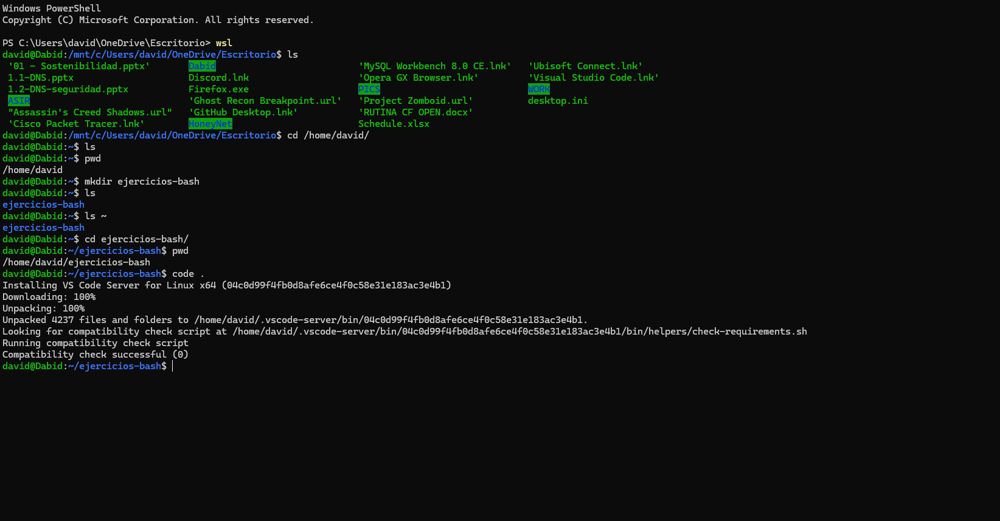
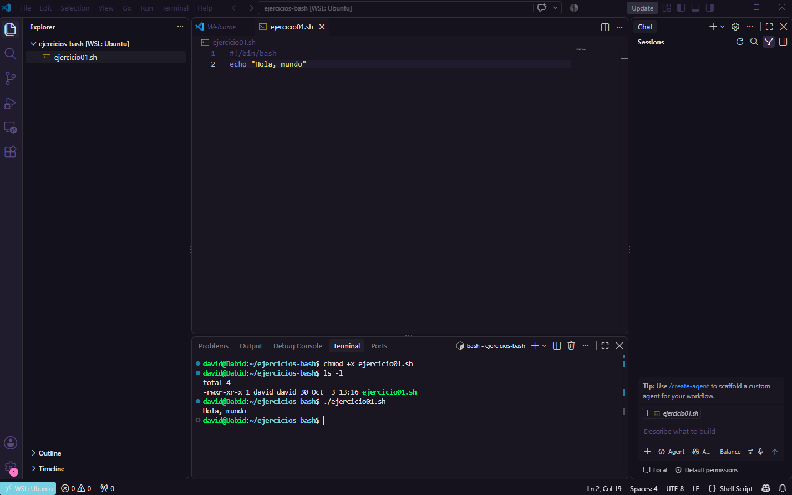

# 🐧 Guía: preparar un entorno para hacer scripts en Bash desde Windows

Esta guía explica, paso a paso, cómo preparar un ordenador con **Windows** para crear y ejecutar **scripts de Bash en Linux real**, usando **WSL2 (Ubuntu)** y **Visual Studio Code**.

Al terminar, el lector tendrá una carpeta de trabajo llamada `ejercicios-bash` y su primer script funcionando.

---

## 📑 Índice

1. [Qué se necesita](#1-qué-se-necesita)
2. [Conceptos básicos](#2-conceptos-básicos)
3. [Instalar WSL2 con Ubuntu](#3-instalar-wsl2-con-ubuntu)
4. [Abrir la terminal de Ubuntu](#4-abrir-la-terminal-de-ubuntu)
5. [Crear la carpeta de trabajo](#5-crear-la-carpeta-de-trabajo)
6. [Abrir la carpeta con Visual Studio Code](#6-abrir-la-carpeta-con-visual-studio-code)
7. [Crear y ejecutar el primer script](#7-crear-y-ejecutar-el-primer-script)
8. [Crear un acceso directo en el Escritorio](#8-crear-un-acceso-directo-en-el-escritorio)
9. [Problemas frecuentes y soluciones](#9-problemas-frecuentes-y-soluciones)
10. [Resumen de comandos](#10-resumen-de-comandos)

---

## 1. Qué se necesita

- Un ordenador con **Windows 10 (versión 2004 o superior)** o **Windows 11**.
- Conexión a internet para descargar Ubuntu y Visual Studio Code.
- La **virtualización activada** en la BIOS del equipo (normalmente ya viene activada).
- **Visual Studio Code** instalado en Windows, con la extensión **WSL** (de Microsoft).

---

## 2. Conceptos básicos

| Concepto | Explicación sencilla |
|---|---|
| **WSL** | *Windows Subsystem for Linux*. Una función de Windows que permite ejecutar un Linux real dentro de Windows, sin reiniciar ni instalar otro sistema. |
| **Ubuntu** | Una de las versiones (distribuciones) de Linux más usadas. |
| **Terminal** | Una ventana donde se escriben órdenes con el teclado para que el ordenador las ejecute. |
| **Bash** | El lenguaje que entiende la terminal de la mayoría de los sistemas Linux. |
| **Script** | Un archivo de texto con una lista de órdenes que el ordenador ejecuta una tras otra. |
| **Ruta** | La dirección de una carpeta o archivo dentro del sistema. Por ejemplo, `/home/david/ejercicios-bash`. |

---

## 3. Instalar WSL2 con Ubuntu

**Paso 1.** Abrir **PowerShell como administrador**: clic derecho sobre el menú Inicio y elegir *Terminal (administrador)*.

**Paso 2.** Escribir el siguiente comando:

```powershell
wsl --install
```

| Parte | Qué significa |
|---|---|
| `wsl` | El programa de Windows que gestiona el subsistema de Linux. |
| `--install` | Una opción que le ordena instalar WSL y la distribución Ubuntu por defecto. |

**Paso 3.** Reiniciar el ordenador cuando lo pida.

**Paso 4.** Al volver, Ubuntu se abre solo y pide crear un **nombre de usuario** y una **contraseña**.

> 💡 Al escribir la contraseña en Linux **no se ve nada en pantalla** (ni siquiera asteriscos). Es normal: se escribe igualmente y se pulsa Enter.

**Paso 5 (opcional).** Comprobar que todo está correcto:

```powershell
wsl --status
```

El resultado debe indicar `Default Distribution: Ubuntu` y `Default Version: 2`.

> ℹ️ **Aviso que puede aparecer:** `WSL1 is not supported with your current machine configuration`. Si la versión predeterminada es **2** y Ubuntu aparece instalado, este mensaje es solo informativo (se refiere a la versión 1 de WSL, que no se usa) y se puede ignorar.

Para ver las distribuciones instaladas y su versión:

```powershell
wsl -l -v
```

La columna `VERSION` debe mostrar `2`.

---

## 4. Abrir la terminal de Ubuntu

Hay varias formas. Estas son las más sencillas:

- **Menú Inicio:** pulsar la tecla Windows, escribir `Ubuntu` y abrir la aplicación.
- **Desde PowerShell:** escribir el comando `wsl`.

Se sabe que se está dentro de Ubuntu cuando el texto de la terminal tiene este aspecto:

```text
david@Dabid:~$
```

Se compone de `usuario@equipo:ruta$`. El símbolo `~` indica que se está en la **carpeta personal** (`/home/david`).

---

## 5. Crear la carpeta de trabajo

### ¿Dónde crearla?

Se recomienda crearla **dentro de Linux** (en `/home/usuario`) y **no** en el disco de Windows (`/mnt/c/...`), por estos motivos:

- Es **más rápida**, sobre todo al usar Git.
- Los **permisos de Linux** (`chmod`) funcionan correctamente.
- Se evitan problemas con **OneDrive** y con los **saltos de línea** de Windows.
- Se parece más a un **servidor real**.

### Comandos



*Imagen 1: desde PowerShell se entra en Ubuntu con `wsl`, se crea la carpeta `ejercicios-bash` y se abre con `code .`.*

**1. Ir a la carpeta personal:**

```bash
cd /home/david/
```

| Parte | Qué significa |
|---|---|
| `cd` | *change directory*: cambiar de carpeta. |
| `/home/david/` | Ruta absoluta de la carpeta personal. Una forma más corta es `cd ~`. |

**2. Comprobar en qué carpeta se está:**

```bash
pwd
```

**`pwd`** (*print working directory*) muestra la ruta de la carpeta actual. Debe responder `/home/david`.

**3. Crear la carpeta:**

```bash
mkdir ejercicios-bash
```

| Parte | Qué significa |
|---|---|
| `mkdir` | *make directory*: crear una carpeta. |
| `ejercicios-bash` | El nombre de la carpeta. Se crea en la carpeta donde se está (ruta relativa). |

Si todo va bien, **no muestra ningún mensaje**. En Linux, que un comando no responda nada suele indicar que ha funcionado.

> 💡 Conviene evitar **espacios y tildes** en los nombres de carpetas y archivos. Por eso se usa un guion (`ejercicios-bash`).

**4. Comprobar que existe:**

```bash
ls
```

**`ls`** (*list*) muestra el contenido de la carpeta actual. Debe aparecer `ejercicios-bash`.

**5. Entrar en la carpeta:**

```bash
cd ejercicios-bash
```

Y comprobar la ruta con `pwd`. Debe responder `/home/david/ejercicios-bash`.

> 💡 La tecla **Tab** autocompleta nombres. Se puede escribir `cd ej` y pulsar Tab.

---

## 6. Abrir la carpeta con Visual Studio Code

Desde la terminal, dentro de la carpeta de trabajo, escribir:

```bash
code .
```

| Parte | Qué significa |
|---|---|
| `code` | El comando que abre Visual Studio Code. |
| `.` | Un punto significa "la carpeta actual". |

La **primera vez** aparecen mensajes como `Installing VS Code Server for Linux` (visibles en la Imagen 1). Es normal: VS Code instala un pequeño componente dentro de Ubuntu para poder trabajar con Linux. Hay que esperar sin cerrar la terminal.

### Comprobaciones al abrirse VS Code

1. **Abajo a la izquierda** debe aparecer **`WSL: Ubuntu`**. Indica que VS Code trabaja dentro de Linux.
2. Si aparece **Restricted Mode** (modo restringido), es una medida de seguridad de VS Code. Al ser una carpeta propia, se puede pulsar **Yes, I trust the authors** (Sí, confío en los autores) cuando lo pregunte.

---

## 7. Crear y ejecutar el primer script

### 7.1. Crear el archivo

En el panel izquierdo de VS Code, pulsar el icono de **"Nuevo archivo"**, escribir el nombre `ejercicio01.sh` y pulsar Enter.

### 7.2. Escribir el contenido

```bash
#!/bin/bash
echo "Hola, mundo"
```

| Línea | Qué significa |
|---|---|
| `#!/bin/bash` | Se llama *shebang*. Indica que el archivo es un script y que debe ejecutarse con **Bash**. Siempre va en la primera línea. |
| `echo "Hola, mundo"` | `echo` muestra un texto en pantalla. El texto va entre comillas dobles. |

Guardar con **Ctrl + S**.

### 7.3. Abrir la terminal de VS Code

Pulsar **Ctrl + ñ** (o menú *Terminal → Nueva terminal*). Se abre un panel inferior que ya está dentro de Linux y en la carpeta correcta.

### 7.4. Dar permiso de ejecución

```bash
chmod +x ejercicio01.sh
```

| Parte | Qué significa |
|---|---|
| `chmod` | *change mode*: cambia los **permisos** de un archivo. |
| `+x` | Añade el permiso de **ejecución** (`x` de *execute*). Sin él, Linux trata el archivo como un simple texto. |
| `ejercicio01.sh` | El archivo al que se aplica el cambio. |

Solo hace falta **una vez por script**.

### 7.5. Comprobar los permisos

```bash
ls -l
```

La opción `-l` (*long*) muestra una línea por archivo con información detallada:

```text
-rwxr-xr-x 1 david david 30 Oct  3 13:16 ejercicio01.sh
```

Las letras del principio son los permisos: `r` (leer), `w` (escribir) y `x` (ejecutar). Si aparece la `x`, el permiso está concedido. Además, el nombre del archivo se muestra **en verde**, que es el color que usa la terminal para los archivos ejecutables.

### 7.6. Ejecutar el script

```bash
./ejercicio01.sh
```

| Parte | Qué significa |
|---|---|
| `./` | El punto es "la carpeta actual" y la barra separa rutas. Significa "el archivo que está aquí". Linux no busca programas en la carpeta actual por seguridad, así que hay que indicarlo. |
| `ejercicio01.sh` | El script que se ejecuta. |

### Resultado esperado



*Imagen 2: el script en el editor (arriba) y, en la terminal (abajo), los comandos `chmod +x`, `ls -l` y `./ejercicio01.sh`, con la salida `Hola, mundo`.*

---

## 8. Crear un acceso directo en el Escritorio

Los archivos de Linux se guardan dentro de WSL, no en el Escritorio de Windows. Para abrirlos con un clic se puede crear un acceso directo:

1. Abrir el **Explorador de archivos** (**Windows + E**).
2. En la barra de direcciones, escribir y pulsar Enter:

   ```text
   \\wsl$\Ubuntu\home\david
   ```

   `\\wsl$` es un "disco de red" especial que WSL crea para que Windows pueda ver los archivos de Ubuntu. Hay que cambiar `david` por el usuario de Linux (se consulta con el comando `whoami`).
3. Clic derecho sobre la carpeta `ejercicios-bash` → **Mostrar más opciones** (solo en Windows 11) → **Enviar a** → **Escritorio (crear acceso directo)**.

> ⚠️ El acceso directo es solo un enlace. Si se **mueve, renombra o borra** la carpeta real, el acceso directo deja de funcionar.

---

## 9. Problemas frecuentes y soluciones

| Problema | Causa | Solución |
|---|---|---|
| `Windows Subsystem for Linux not detected` | WSL no está instalado o no hay ninguna distribución. | Ejecutar `wsl --install` en PowerShell como administrador y reiniciar. |
| `WSL1 is not supported...` | Aviso informativo sobre la versión 1 de WSL. | Si `wsl --status` muestra `Default Version: 2` y Ubuntu está instalado, se puede ignorar. |
| `code: command not found` | VS Code no está en el PATH. | Cerrar y abrir la terminal. Si persiste, reinstalar VS Code marcando *Añadir al PATH*. |
| No aparece `WSL: Ubuntu` en VS Code | VS Code se abrió desde Windows y no desde Ubuntu. | Cerrarlo y ejecutar `code .` desde la terminal de Ubuntu. |
| `Permission denied` al ejecutar | Falta el permiso de ejecución. | `chmod +x archivo.sh` |
| `command not found` al ejecutar | Se escribió `archivo.sh` sin `./`. | Escribir `./archivo.sh` |
| `bad interpreter: /bin/bash^M` | El archivo tiene saltos de línea de Windows (CRLF). | En VS Code, abajo a la derecha, cambiar **CRLF** por **LF** y guardar. O usar `dos2unix archivo.sh`. |
| `ls` en el Escritorio de Windows sale vacío | El Escritorio real está dentro de OneDrive. | Usar la ruta `/mnt/c/Users/usuario/OneDrive/Escritorio` (o `Desktop` según el idioma). |

---

## 10. Resumen de comandos

| Comando | Para qué sirve |
|---|---|
| `wsl --install` | Instala WSL con Ubuntu (PowerShell como administrador). |
| `wsl --status` | Muestra el estado y la versión de WSL. |
| `wsl -l -v` | Lista las distribuciones instaladas y su versión. |
| `wsl` | Entra en Ubuntu desde PowerShell. |
| `pwd` | Muestra la carpeta actual. |
| `ls` | Lista el contenido de la carpeta actual. |
| `ls -l` | Lista con detalles (permisos, tamaño, fecha). |
| `cd carpeta` | Entra en una carpeta. |
| `cd ..` | Sube a la carpeta superior. |
| `cd ~` | Vuelve a la carpeta personal. |
| `mkdir carpeta` | Crea una carpeta. |
| `code .` | Abre VS Code en la carpeta actual. |
| `chmod +x script.sh` | Da permiso de ejecución a un script. |
| `./script.sh` | Ejecuta un script que está en la carpeta actual. |

---

> Las imágenes se enlazan con **rutas relativas** (`images/...`). Para que se vean en GitHub, la carpeta `images` debe subirse junto al archivo `.md`, con esos mismos nombres.
